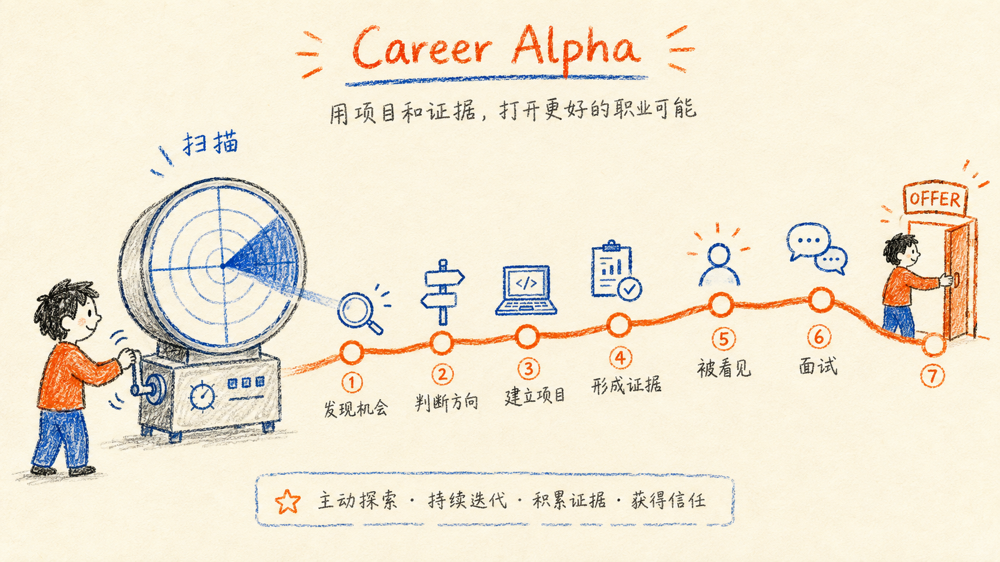
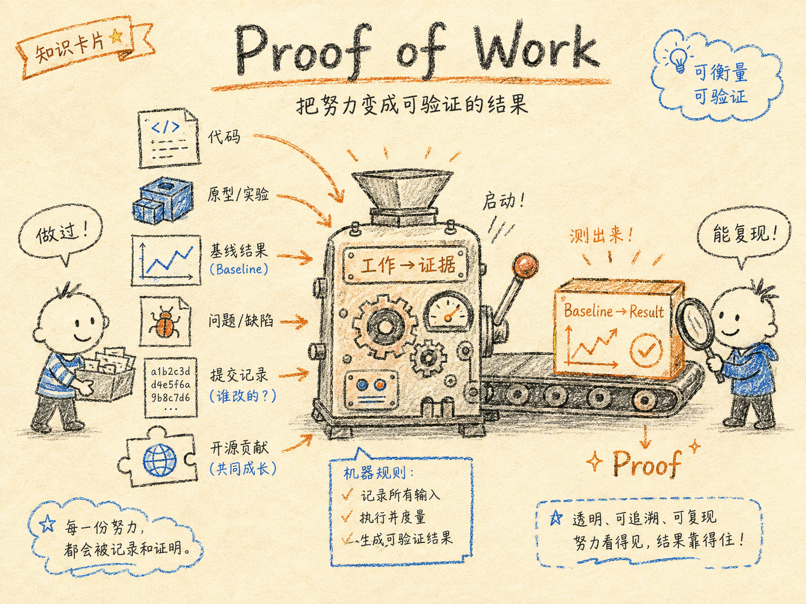
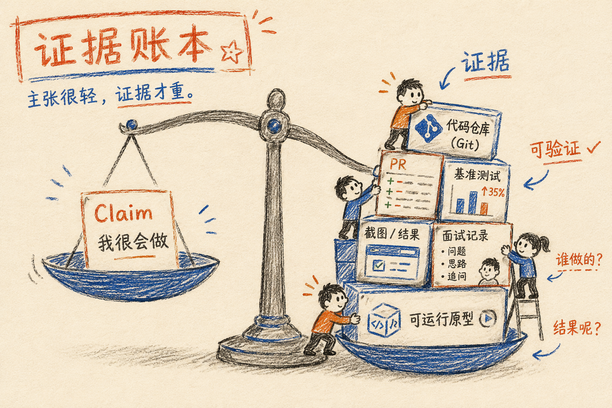

# Career Alpha

> **Find your career alpha before it becomes consensus.**
>
> 在机会成为共识之前，找到你的职业 Alpha。

[English README](README_en.md)

Career Alpha 是一套面向 AI 时代的开源求职工作流。它从趋势发现开始，把机会拆成可进入的职业楔子，再用真实项目或开源贡献制造证据，最后把证据转成岗位语言、面试防守和投递反馈。

它不只是把已有经历写得更漂亮，而是持续回答：

> **未来两周做什么，才能让半年后的自己更值钱？**



*Career Alpha 的完整路径：从扫描机会、判断方向，到项目、证据、面试与 Offer。*

## 30 秒了解

输入：

- 你的背景、目标岗位和地区；
- 每周可投入的时间；
- 已有项目、开源记录或求职反馈。

输出：

- 一个有来源和时间窗口的机会判断；
- 一个可在 2–7 天内验证的切入口；
- 一组可核验的项目、PR、Benchmark 或部署证据；
- 一套能经得起追问的简历、面试和投递动作。

## Core Loop

```text
/radar
  ↓ 发现正在形成的需求
/wedge
  ↓ 选择供需错位的进入点
┌───────────────┐
│               │
▼               ▼
/contributor   /build
真实开源贡献    Proof of Work 项目
│               │
└───────┬───────┘
        ↓
/proof
建立 Claim–Evidence Ledger
        ↓
/position
岗位定位与经历重组
        ↓
┌───────┴────────┐
▼                ▼
/interview      /offer
面试防守        投递与市场反馈
```

这不是固定的线性流程。你可以从当前最需要的入口开始，也可以在任意阶段回到上游补证据或修正假设。



*Proof of Work：把努力变成可验证的结果。*

## Skills

| Skill | 适用场景 | 主要交付 |
| --- | --- | --- |
| /radar | 扫描技术、行业和招聘需求变化 | Trend Radar、时间窗口、反例 |
| /wedge | 找到需求增长快于人才供给的切入口 | Opportunity Score、入口任务、kill criteria |
| /contributor | 寻找真实、可提交并可验证的开源贡献 | Contribution Plan、PR 证据 |
| /build | 把机会转成 2–7 天 Proof of Work | Mission Brief、里程碑、完成标准 |
| /proof | 整理项目、PR、比赛或工作的证据 | Evidence Card、Claim–Evidence Ledger |
| /position | 把证据翻译成目标岗位语言 | 定位、简历 bullet、HR / Founder outreach |
| /interview | 连续追问，检验简历主张是否站得住 | Risk Map、Live Drill、Defense Report |
| /offer | 管理投递、面试、拒信、Offer 和反馈 | Pipeline、Funnel、Next Actions |

## How to use

### 入口选择

| 你的问题 | 推荐入口 |
| --- | --- |
| 哪些方向值得提前布局？ | /radar |
| 我应该从哪个细分岗位切入？ | /wedge |
| 如何获得真实协作证据？ | /contributor |
| 三天能做什么证明能力？ | /build |
| 这句话有证据支撑吗？ | /proof |
| 如何改写简历和自我介绍？ | /position |
| 面试官会怎样追问？ | /interview |
| 如何整理投递和复盘拒信？ | /offer |

### 常见路径

```text
没有相关经历：
/position → /wedge → /build 或 /contributor → /proof

已有项目但不会表达：
/proof → /position → /interview

投递后反馈混乱：
/offer → /position / wedge / radar
```

### 示例

```text
/position
目标：Agent Engineer
经历：做过 AI 教育项目、参加过黑客松、写过几个 Agent demo。
```

Career Alpha 不会直接把这些经历包装成“主导生产级 Agent 系统”，而会区分：

- 稳妥定位：由现有证据直接支持；
- 进取定位：可以防守但仍需说明边界；
- 未来定位：需要先补哪些项目或协作证据。

## Evidence Layer

所有核心 skill 共享 Claim–Evidence Ledger。每条强主张都应拆成：



*证据账本：让每条主张都有对应的证据、结果和 ownership。*

```text
Claim:
Built an agent harness benchmark.

Evidence:
- GitHub repository
- architecture diagram
- benchmark.csv
- demo

Result:
61% → 78%

Ownership:
本人负责 benchmark design、retry policy 和 context strategy。
UI 由队友完成。

Confidence:
VERIFIED

Interview risks:
- 为什么选择这组任务？
- 如何排除模型版本变化？
- 有没有 regression？
```

没有来源的数字不自动生成；没有直接负责的内容不冒领；未完成的项目、未合并的 PR 和计划中的结果必须保留原状态。

### 跨 skill 交接

跨 skill 组合时，使用 [Cross-skill Handoff Contract](references/handoff-contract.md) 传递最小 Context Packet：

- Goal
- Verified facts
- Hypotheses / freshness-sensitive signals
- Planned work
- Evidence references
- Open questions
- Recommended next skill
- Privacy boundary

下一个 skill 可以改写表达，但不能静默提升 confidence、扩大 ownership，或把计划写成既成事实。

### 结构化账本

需要保存结构化事实时，复制 [career-claim-ledger-template.json](assets/career-claim-ledger-template.json)。字段约束见 [claim-evidence-ledger.schema.json](references/claim-evidence-ledger.schema.json)。

模板默认 local-only。招聘邮件、联系人、薪资、内部链接和未公开项目不要写入公开仓库。

## Design Principles

### 1. Asymmetric opportunity

不要只问什么最热门，而要问：哪里已经有真实需求，但做过的人还不多？

### 2. Proof before polish

先建立项目、PR、Benchmark、部署或用户反馈等证据，再优化表达。

### 3. No fabricated alpha

不虚构公司、职位、技术栈、用户量、收入、性能提升、排名或 ownership。

### 4. Fresh signals, explicit uncertainty

趋势、岗位、公司和市场条件会变化。当前判断应标注来源、日期、样本量和不确定性。

### 5. Interview-defensible by default

任何写进简历的强主张，都应该能被连续追问至少五层而不崩。

## Installation

### Codex

把仓库链接发给 Codex，并要求安装其中的 skills：

```text
请从这个仓库安装 Career Alpha，并启用 radar、wedge、contributor、build、proof、position、interview、offer：
https://github.com/lavine888/career-alpha
```

### Claude Code / OpenCode

仓库提供对应的 plugin manifest，以及每个 skill 的入口元数据。不同客户端共享同一套 skills、references 和 assets。

## Repository Structure

```text
career-alpha/
├── .codex-plugin/plugin.json
├── .claude-plugin/plugin.json
├── .opencode-plugin/plugin.json
├── skills/
│   └── <skill>/
│       ├── SKILL.md
│       └── agents/openai.yaml
├── references/
│   ├── career-alpha-playbook.md
│   ├── trend-scoring-framework.md
│   ├── opportunity-scoring.md
│   ├── proof-of-work-standard.md
│   ├── claim-evidence-ledger.md
│   ├── claim-evidence-ledger.schema.json
│   ├── handoff-contract.md
│   ├── resume-language-guide.md
│   └── interview-defense-framework.md
├── assets/
│   ├── career-alpha-visual-01.png
│   ├── career-alpha-visual-02.png
│   ├── career-alpha-visual-03.png
│   └── career-claim-ledger-template.json
├── tests/
│   ├── skill-routing-cases.yaml
│   └── routing-boundary-cases.yaml
└── scripts/
    ├── validate_skills.py
    └── validate_package.py
```

## Validation

在仓库根目录运行：

```bash
python3 scripts/validate_skills.py
python3 scripts/validate_package.py
```

基础校验检查 skill、frontmatter、插件 JSON、引用和路由文件；严格校验进一步检查入口元数据、交接契约、账本 Schema、模板和路由字段结构。

## Contribution Boundary

- 只写入真实、可核验或明确标记为计划的经历。
- 当前趋势和招聘市场信息尽量使用新鲜来源，并保留来源与日期。
- 任何会产生外部写入的 fork、branch、patch、PR 或消息，都应先展示动作、验证方式和风险。
- 公开示例只保留最小必要信息，敏感求职材料默认留在本地。

## License

MIT
