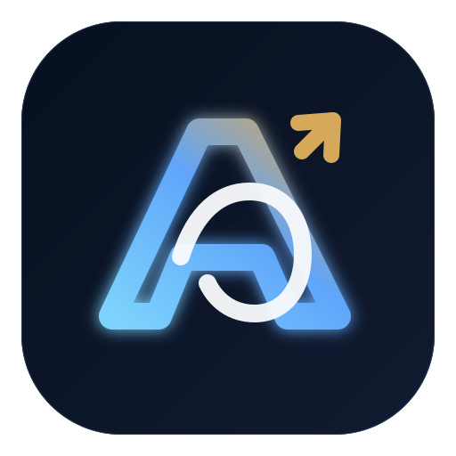
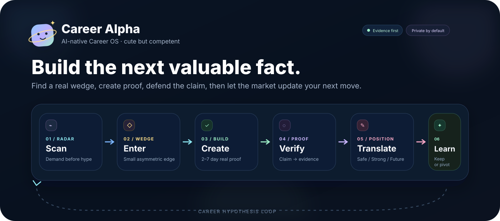

<div align="center">



# Career Alpha

### AI-native Career OS

**Find your career alpha before it becomes consensus.**

[中文](README.md) · [Open Workbench](assets/career-alpha-workbench.html) · [5-minute Quickstart](docs/quickstart.md) · [Installation](docs/installation.md) · [Cases](docs/cases/README.md)


</div>



---

Most career tools start with:

> **What have you already done, and how can you phrase it better?**

Career Alpha moves one step upstream:

> **What should you build over the next two weeks so your future profile contains stronger facts?**

It connects **trend discovery → asymmetric wedges → proof of work → evidence → positioning → interview defense → market feedback** into one Career Hypothesis Loop.

**Don’t fake experience. Build real evidence faster.**

---

## ⚡ Workbench v0.3

[`assets/career-alpha-workbench.html`](assets/career-alpha-workbench.html) is a single-file, local-first career workbench. Open it directly in a browser; no server is required.


v0.3 includes:

- **3-step Start Guide** — recommends `/radar`, `/proof`, `/position`, or `/offer` from the target role, current evidence, and available weekly time;
- **Trend Radar** — tracks demand signals, market stage, and counter-evidence;
- **Opportunity Wedge** — Demand / Scarcity / Proofability / Timing plus kill criteria;
- **Proof of Work** — tracks verifiable projects, PRs, benchmarks, and completion state;
- **Claim–Evidence Ledger** — `VERIFIED / SUPPORTED / SELF-REPORTED / PLANNED`;
- **Career Health** — separate Signal Confidence / Evidence Strength / Market Validation axes, with no fake aggregate score;
- **Career Summary** — shows the current wedge and recommended next skill;
- **Application Pipeline** — Discover → Active → Outcome;
- **Interview Defense** — tracks the riskiest claim and the next pressure-test;
- **Case Lab** — offline Agent Engineer / AI PM / Quant / Robotics states;
- **Share Card** — locally generates a 1600×900 Career Alpha Snapshot PNG;
- **Adaptive Buddy** — moves through sleepy / focus / happy / celebrate states as evidence and market validation change.

### Local-first data boundary

Workbench never automatically uploads career data.

```text
localStorage key: career-alpha-workbench-v2
state schema:     1.0
```

v0.3 adds [`assets/workbench-state.schema.json`](assets/workbench-state.schema.json):

- legacy `career-alpha-workbench-v1` data migrates automatically;
- imported JSON is normalized before becoming active state;
- unknown future `schema_version` values are rejected instead of silently corrupting state;
- exported state always includes `schema_version: "1.0"`.

---

## Core Loop

```text
/radar
  ↓ discover real demand
/wedge
  ↓ choose the smallest asymmetric entry
┌───────────────┐
▼               ▼
/contributor   /build
external proof  Proof of Work
└───────┬───────┘
        ↓
      /proof
Claim–Evidence Ledger
        ↓
    /position
Safe / Strong / Future
        ↓
┌───────┴───────┐
▼               ▼
/interview     /offer
pressure-test   market feedback
                  │
                  └──→ back to /radar /wedge /build
```

---

## 8 Skills

| Skill | Question | Main output |
| --- | --- | --- |
| **`/radar`** | What is forming before it becomes consensus? | signal hierarchy, counter-evidence, timing window |
| **`/wedge`** | Where is the smallest asymmetric entry point? | wedge comparison, 72h test, kill criteria |
| **`/build`** | What fact is worth creating in 2–7 days? | mission brief, baseline, evaluation, DoD |
| **`/contributor`** | How can open-source collaboration create external proof? | repo rubric, PR evidence, review boundary |
| **`/proof`** | Which career claims actually survive scrutiny? | atomic claim audit, confidence, ownership |
| **`/position`** | How should evidence translate into role language? | Safe / Strong / Future positioning |
| **`/interview`** | Which claim is most likely to collapse under follow-up? | Risk Map, five-layer drill, Defense Report |
| **`/offer`** | Does real market feedback support the hypothesis? | pipeline, feedback loop, KEEP / REFINE / PIVOT |

Each skill ships with its own `references/` toolbox rather than a single prompt file.

---

## 🎯 4 End-to-End Cases

| Case | Core Wedge | Proof of Work |
| --- | --- | --- |
| **[Agent Engineer](docs/agent-engineer-end-to-end.md)** | Agent Reliability / Evaluation | harness benchmark, failure taxonomy, ablation |
| **[AI Product Manager](docs/cases/ai-product-manager.md)** | Workflow + Evaluation PM | workflow, eval rubric, human fallback, outcome metrics |
| **[Quant Researcher](docs/cases/quant-researcher.md)** | Robustness-first Research | cost model, sensitivity, failure regimes |
| **[Robotics / Physical AI](docs/cases/robotics-engineer.md)** | Eval + Reliability | fixed scenarios, recovery benchmark, simulation boundary |

Shared rule:

> **Do not ask how to package a project first. Ask what fact is still missing before you can honestly make a stronger claim.**

---

## Integrity: Evidence First is executable

Career Alpha runs two regression suites for evidence transitions:

```bash
npm run eval:handoff
npm run eval:integrity
```

They are designed to catch:

- `PLANNED` work silently becoming completed work;
- team outcomes expanding into sole personal ownership;
- weak evidence escalating to `VERIFIED`;
- a backtest being described as a production result;
- simulation or demos being described as real-world deployment;
- uncertainty disappearing across `/radar → /wedge → /proof` without new evidence.

Real-case collection follows a separate protocol under [`docs/real-cases/`](docs/real-cases/README.md).

---

## Browser E2E

v0.3 does not only test whether button labels exist. Playwright opens the real Workbench and executes:

```text
Onboarding
→ Case Lab
→ localStorage persistence
→ v1 → v2 migration
→ Share Card rendering
→ schema-aware JSON export
```

Run:

```bash
npm install
npx playwright install chromium
npm run test:e2e
```

Full validation:

```bash
npm run validate
npm run test:e2e
```

---

## Local Workspace / CLI

```bash
npm run init
npm run demo
npm run snapshot
```

`npm run init` creates the local `.career-alpha/` workspace, which is ignored by Git by default.

`npm run snapshot` creates a reviewable Markdown Career Alpha Snapshot. You still decide what is safe to publish.

---

## Installation

See [docs/installation.md](docs/installation.md) for full setup.

### Codex

```text
Install Career Alpha from this repository and enable radar, wedge, contributor, build, proof, position, interview, and offer:
https://github.com/lavine888/career-alpha
```

### Claude Code

```text
/plugin marketplace add lavine888/career-alpha
/plugin install career-alpha@career-alpha
```

The repository also ships:

```text
.codex-plugin/
.claude-plugin/
.opencode-plugin/
.trae-plugin/
```

All clients share the same `skills/`, `references/`, and evidence contract.

---

## Repository Structure

```text
career-alpha/
├── assets/
│   ├── career-alpha-logo.svg
│   ├── career-alpha-mascot.svg
│   ├── career-alpha-hero.svg
│   ├── career-alpha-workbench.html
│   ├── workbench-preview.svg
│   └── workbench-state.schema.json
├── skills/<skill>/
│   ├── SKILL.md
│   ├── agents/openai.yaml
│   └── references/
├── references/
├── docs/
│   ├── cases/
│   └── real-cases/
├── examples/workbench/
├── tests/
│   ├── e2e/
│   └── integrity-eval-cases.json
├── scripts/
├── playwright.config.mjs
├── ROADMAP.md
└── package.json
```

---

## Design Principles

1. **Asymmetric opportunity** — look for temporary demand/supply mismatches, not only the hottest field.
2. **Proof before polish** — build Repo / PR / Benchmark / Deployment / User Feedback before polishing language.
3. **No fabricated alpha** — do not invent titles, numbers, rankings, production status, or ownership.
4. **Fresh signals, explicit uncertainty** — preserve sources, dates, sample limitations, and uncertainty.
5. **Interview-defensible by default** — strong claims should survive continuous follow-up.
6. **Market feedback closes the loop** — applications are data for the next career hypothesis, not the end of the process.

---

## Contributing

Real anonymized Career Alpha loops, wedge / benchmark patterns, failure cases, routing/eval cases, and Workbench improvements are welcome.

See [CONTRIBUTING.md](CONTRIBUTING.md) and [ROADMAP.md](ROADMAP.md).

## License

MIT
